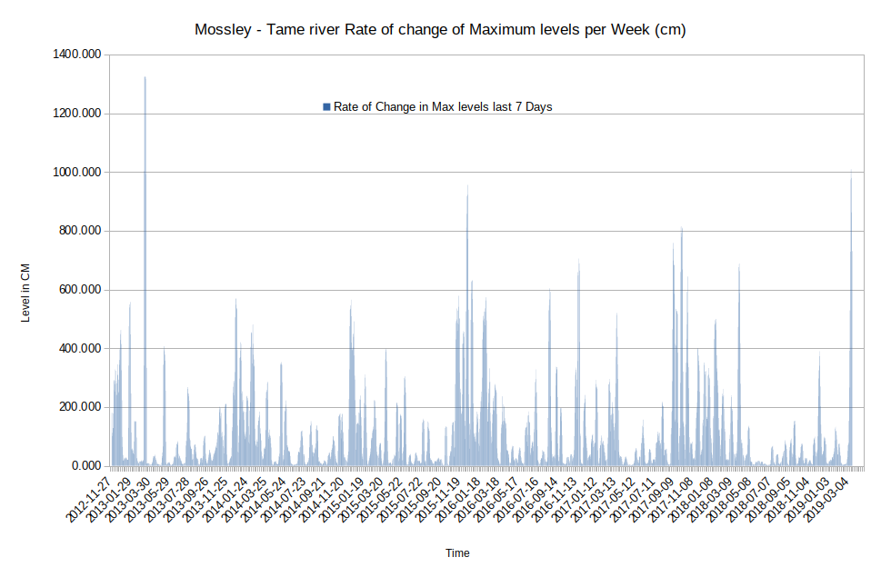
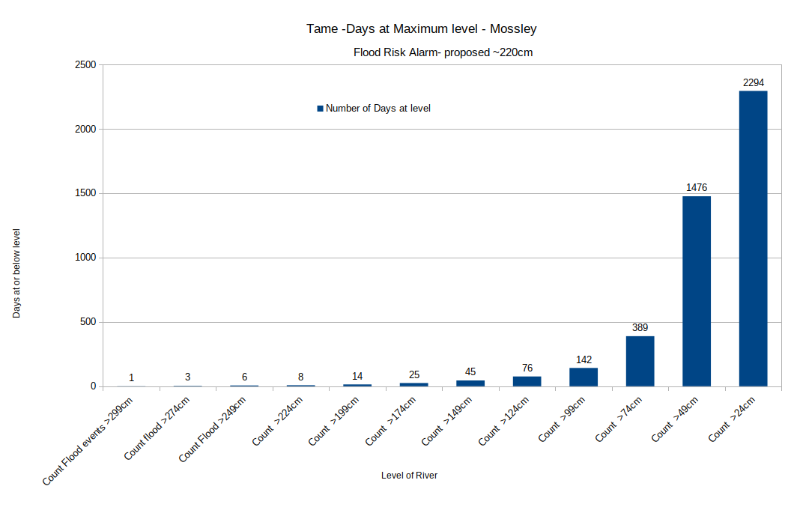
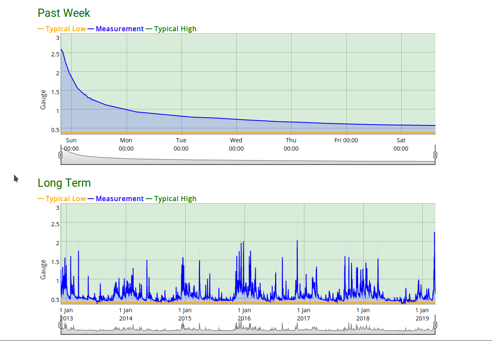
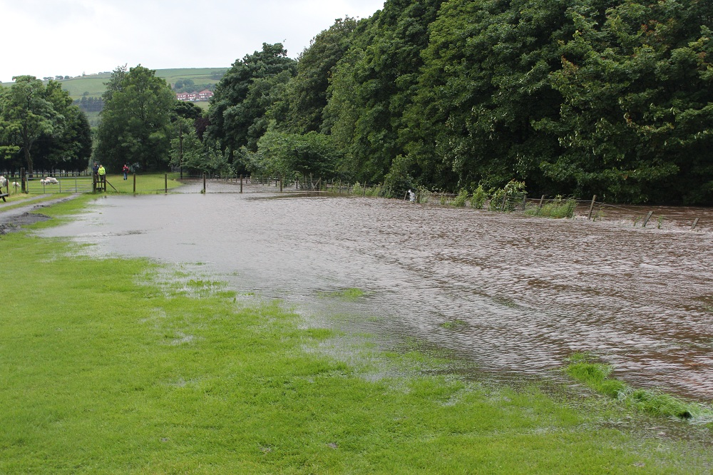
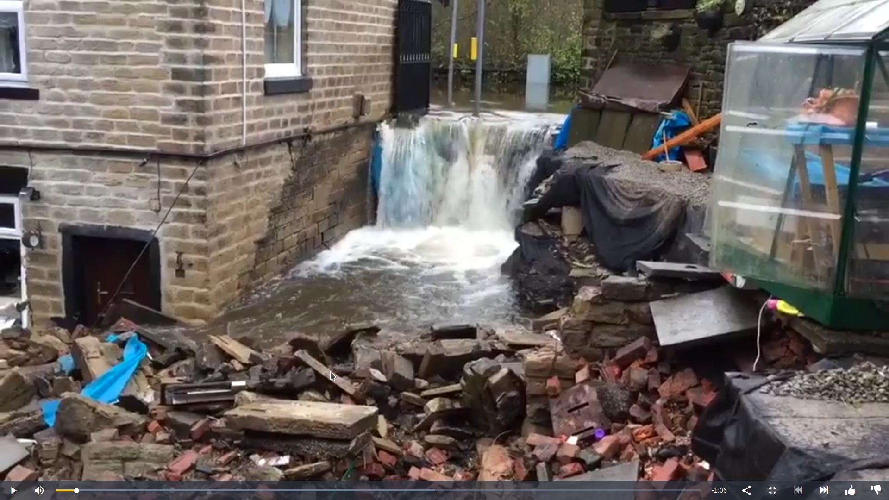
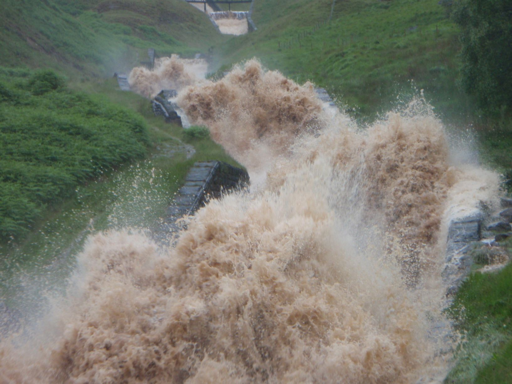
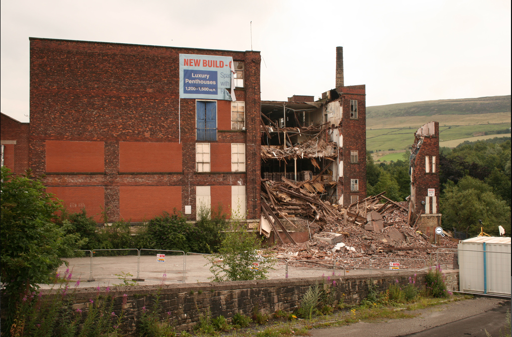

# Tame-Mossley-FloodRisk  

## Analysis of Tame river Mossley river level Gauge readings    

### Summery  

The long term river Tame level data shows the Tame has flood risk levels on a consistent basis. The flood levels were set to 330cm to indicate flood danger.  

Flood Danger : The North West river basin district Flood Risk Management Plan 2015 to 2021 [Ref21] says of Mossley :  

#### Conclusions for the Greater Manchester Flood Risk Area  [Ref21] :     

*Quote : 3.Steeper ground in areas such as Ramsbottom, Littleborough, Delph and Mossley leads to fast flowing surface water and rapid inundation, both of which can be hazardous.*  

The long term analysis of North west rainfall shows there is a significant risk of greater levels of rain in the past, in the 1930s and 1940s there could be 5 >150 mm per month, rainfall events per year.  This shows flooding incidence are currently low and flooding events of greater magnitude are inevitable.  

The flood event on 16-3-2013 coincides with a huge flood reading at Uppermill, which means the maximum flood level reading needs reviewing.  i.e Some "flooding/level" incident occurred as it was recorded on 2 independent gauges. This extra high reading isn't recorded as a highest ever level, yet it may have been a real event.

From analysis of the chart of the rate of change of daily maximum river level at Mossley.  

It can be clearly observed that the rate of change of the average level has remain steady around 60cm cumulative daily rate of change per week.  

Whereas the Maximum Rate of change has linearly increased over the monitoring period, apart from the 2013 flood anomaly.  

This shows the rate that the river level goes up - has got higher from 600 (cm Change per day per week) to over 800  (cm/d/w).  

i.e. An increase in "Speed of floods" or "Run off" of 125%. 

i.e. Since the level of rainfall is currently normal to low, this increase in flood level speed can only be accounted for by a reduction of rainfall soak in the Tame flood plain and surrounding catchment area.  

note : This is a daily reading so, "real time" flood speeds may changing by an even greater amount. It is imperative to analyse the real time data for increase in flood angle against rainfall. 

The flood in Mossley on 11/9/2017 show that the flood warning level should be decreased to ~80cm and the alarm level be set ~240cm at the Waggon gauge Uppermill.  

#### Planner should be taking action as designated by the Environment Agency report [Ref21]  

*Quote : 11. Flood risk is increasing, perhaps substantially, so Planners, Emergency Planners, Asset Managers and others will need to mitigate this  through a mix of collaborative working, **planning policies**, use of ‘worst case’ scenarios, development of contingency plans, and some detailed analysis.*  

### Method  

Gauge data for Mossley Tame river was obtained from :   [Ref1] : riverlevels.uk  

This data contains an average level for the day and a maximum and minimum level for the day.  

The Flood data for 17/3/2019 raw data was obtained Government flood warning information service. [Ref2]  

The data was input into a spreadsheet and various charts were  produced to show various aspects of the river level data, see results and spreadsheet charts tab.  

Rain data from [Ref3] was analysed and compared with flood levels.  

### Observations :  

The recent flood condition of the 17/3/2019 was the latest and also a new daily record level.  

The Analysis of North West rainfall per month from 2012 to 2019 also shows that the normal level of rain is 100 mm per Month and an increase to 150 to 200 mm per Month can cause flooding conditions. This shows once more a disproportional flooding response from relatively minor, or at least usual, variations in rain fall.  

    Flood Mossley 11th September 2017 : Max Gauge reading : 240 cm  

There was a warning of the flood the previous day ~80 cm level, building up to the flood over 4 days.   

This flood shows the high danger of relying on drains and culverts, which get blocked claimed as a partial cause of the flood..  

    Flood Mossley 21st November 2016 : Gauge reading of 298 cm  

Despite major floods - gauge warning level of 330cm was not reached. Previous daily maximum levels of 100cm gave warning of the flood. The flood continued with levels of 200cm.  

Ironically the 26th December 2015 flood report was released a few days earlier on the 30th-10-2016 [Ref6]  

*Quote "The flooding Stalybridge and Mossley was horrendous for the area. A lot of houses damaged by the torrential rain and floods. Was a nightmare"* 

*Quote "A friend has just tweeted that the tunnel near Stalybridge is flooded and so they're stuck on the train there."*  

[Ref8] Homes were destroyed just downstream of Mossley in Stalybridge. 

[Ref12] Flood damage to school in Greenfield 2017 

    Flood Mossley 26th December 2015 : Gauge reading of 295 cm  

Again, the gauge warning level was not triggered. Warning of the flood was given the day before with max levels of ~140cm  

River levels of > 140cm are flood warning levels.  

#### Tame river Mossley , Rate of change of river level, per week

  

#### Tame river, River level 22/3/2019, Warning and Maximum recorded level

  

#### Tame River - Number of days at each level  2012 - 2019

  

#### Tame River - River Tame high level 17/3/2019

  

### Conclusions :  

It is very concerning to observe that most of the new "Maximum river level recorded events" have happened since December 2015.  

The height of floods is historically high, whilst rainfall and level are historically normal to low.  

There is significant danger, buildings have fell down [Ref17] : July 2008 Mill collapses in Mossley.  

*Quote "Firemen ruled out an explosion, but residents believed the roof has been designed to collect water — and that the building could have collapsed under the weight of recent heavy rain.*  

### Further work : 

Raw data from the Tame may be examined, once it is released, to measure any increase in rate of level increase.  

It may also be possible to extract more information from the daily data by cross referencing daily rainfall data, which may show higher levels for the same rain fall as a result of rain fall "soak" reduction and other developments.  

Data could also be cross related to historical developments levels in the area, however requests for development data showed that is not made available..  

The flood in Mossley on 11/9/2017 and 21st/11/2016 both show that the flood warning level should be decreased to ~80cm and the alarm level be set ~240cm at the Waggon gauge Uppermill.  

### Results and charts : 

This chart shows the maximum river levels per day.  

#### Tame Mossley -  Maximum Levels per day, 330cm = Flood risk  

  

#### Tame Mossley - Maximum river Levels per day - per week.  

  

### Tame Mossley - Change in Average river Levels per day.  

  

#### North West England Rainfall level (mm) per Month.   

  

#### Number of Months in North West England with rainfall over 200 mm per Month from 1910 - 2019.  

   

#### Number of Months in North West England  with rainfall over 150 mm per Month from 1910 - 2019.    

  

### Flood Images  

#### Well-i-hole Farm campsite is evacuated and animals rescued. Picture: Stuart Littleford.  

  

#### Destroyed gardens of flooded cottages in Millbrook, Stalybridge [Ref9]  

  

#### Dovestones culverts over whellemed by 2012 flood [Ref10]  

  

These were taken during the heavy rain last Friday, and show a ferocious amount of water coming down the cascade at Ashway in Greenfield.  

The cascade feeds the reservoir at Dovestones.  

Pictures taken and sent in by Denzil Broadhurst, Deputy Team Leader, Oldham Mountain Rescue Team.  

#### Floods, Mossley Micklehurst 2017 [Ref11]

  

#### Mill collapse adjacent to river July 2008  [Ref17]

*Quote "Firemen ruled out an explosion, but residents believed the roof has been designed to collect water — and that the building could have collapsed under the weight of recent heavy rain.*  

  

[Ref1] : https://flood-warning-information.service.gov.uk/station/5145  
[Ref2] : https://riverlevels.uk/tame-mossley-waggon-road#.XJT8lEPLeV4  
[Ref3] : https://www.metoffice.gov.uk/climate/uk/summaries/datasets#yearOrdered  
[Ref4] : https://tamesidereporter.com/2017/09/mossley-hit-by-flash-floods-again-after-torrential-rain/  
[Ref5] : 21st/11/2016 : https://www.bbc.co.uk/news/av/uk-england-manchester-38059186/heavy-rain-and-strong-winds-cause-flooding-in-mossley  
[Ref6] : Flood 26th December 2015 : https://www.greatermanchester-ca.gov.uk/media/1261/boxing-day-flood-report.pdf  
[Ref7] : http://www.saddleworthlife.com/floods-bring-chaos-to-parts-of-saddleworth/  
[Ref8] : Flood November 2015 : https://www.manchestereveningnews.co.uk/news/greater-manchester-news/flooding-millbrook-stalybridge-tameside-houses-12213781  
[Ref9] : Flood 2016 : https://www.manchestereveningnews.co.uk/news/greater-manchester-news/flooding-millbrook-stalybridge-tameside-houses-12213781  
[Ref10] : Flood 2012 : Dovestones Greenfield : http://www.saddleworthlife.com/13239/  
[Ref11] : https://planetradio.co.uk/hits-radio/manchester/news/torrential-rain-causes-flooding-tameside/  
[Ref12] : https://www.oldham-chronicle.co.uk/news-features/8/news-headlines/100868/deep-trouble  
[Ref13] : Uppermill Flood analysis : https://github.com/wrapperband/Tame-Uppermill-FloodRisk  
[Ref14] : Flood Assessment software Open source terrain analysis software : https://github.com/arijitsaha/FloodRisk  
[Ref14] : Open Condition Monitoring : https://github.com/wrapperband/Open-Condition-Monitoring  
[Ref15] : Related flood danger / cause in hill areas : Wall collapse : http://www.mossleycorrespondent.co.uk/?p=3225  
[Ref16] : Related flood danger / cause : Mill Collapse : https://www.flickr.com/photos/21913923@N03/2696179413  
[Ref17] : "Mystery" Mill collapses (after heavy rain 20th July 2008) : https://www.oldham-chronicle.co.uk/news-features/8/news-headlines/11932/mystery-as-old-mill-collapses  
[Ref18] : Related flood danger / cause : Mill Collapse : http://www.stalybridgecorrespondent.co.uk/2018/02/10/homes-evacuated-following-mill-collapse-in-stalybridge/  
[Ref19] Landslide delays trains Mossley Nov 2012 (During a flood) :  https://www.railforums.co.uk/threads/landslide-between-mossley-and-stalybridge-yesterday.74650/  
[Ref20] Concerns of Aberfan-type disaster in Mossley May 2005 : https://www.manchestereveningnews.co.uk/news/local-news/landslide-homes-fear-1149189  
[Ref21] North West river basin district Flood Risk Management Plan 2015 to 2021 : https://assets.publishing.service.gov.uk/government/uploads/system/uploads/attachment_data/file/507122/LIT_10210_NORTH_WEST_FRMP_PART_B.pdf  

