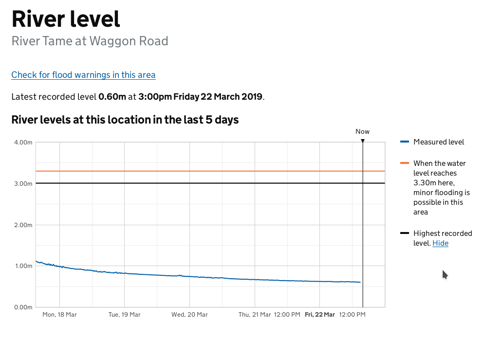
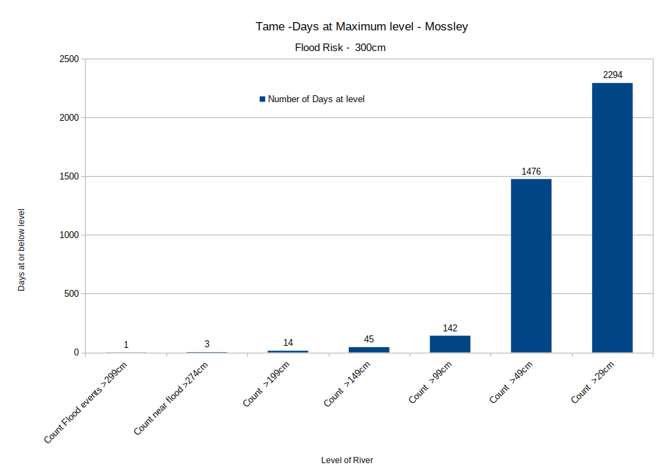
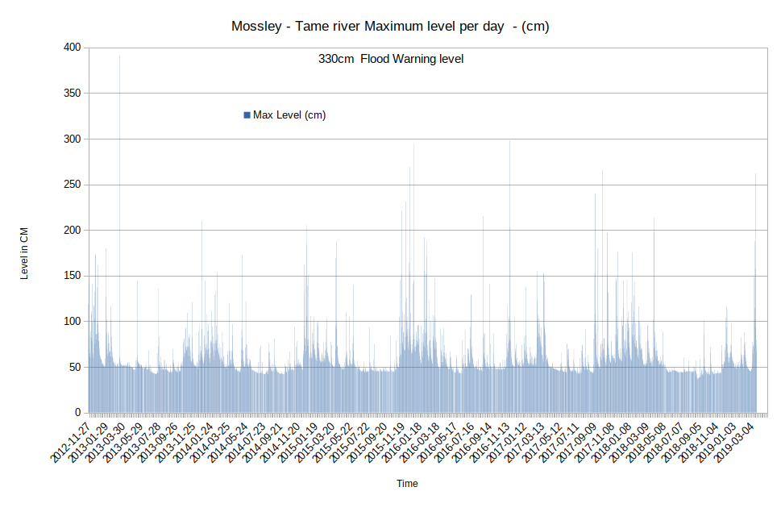
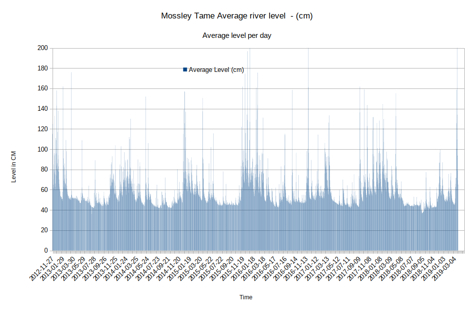
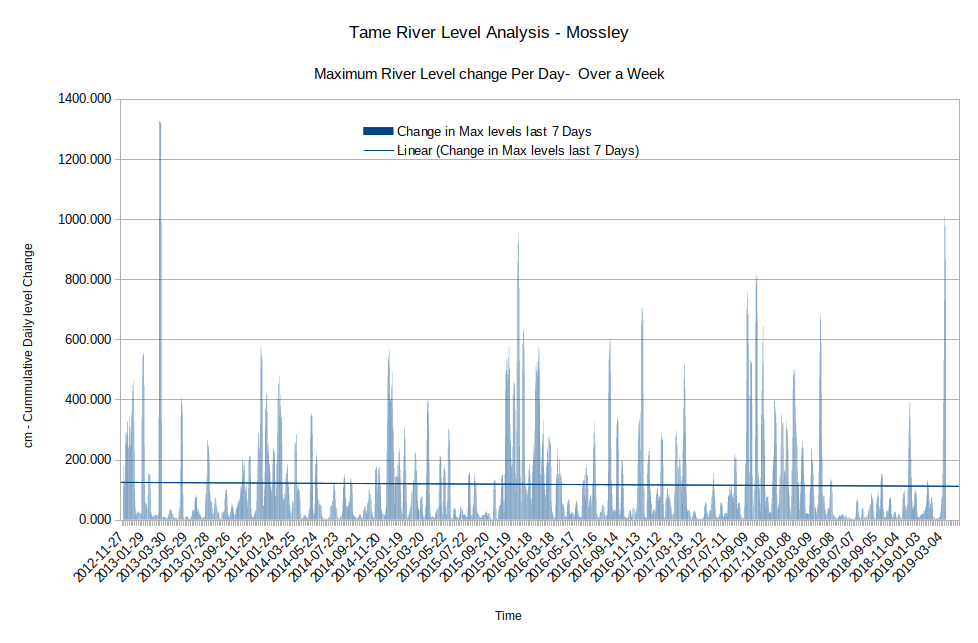
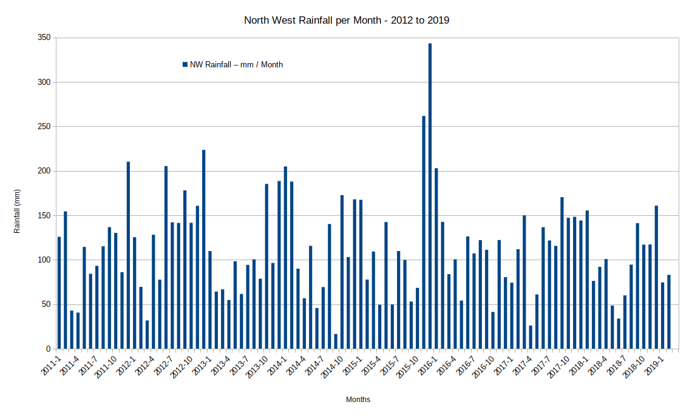
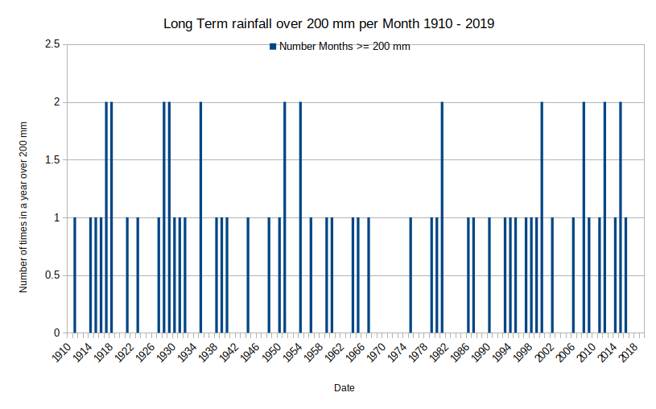
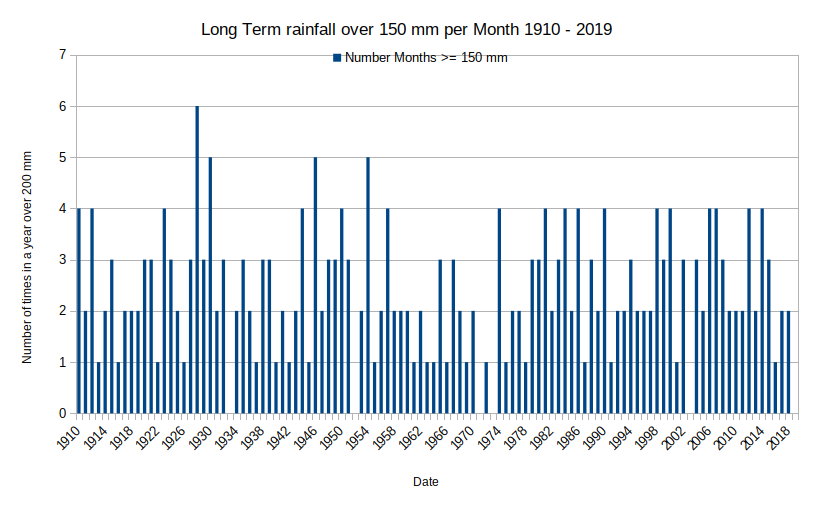

# Tame-Mossley-FloodRisk  

## Analysis of Tame river Mossley river level Gauge readings  

### Summery

The long term river Tame level data shows the Tame has flood risk levels on a consistent basis. The flood levels were set to 330cm to indicate flood danger.

The long term analysis of North west rainfall shows there is a significant risk of greater levels of rain in the past, in the 1930s and 1940s there could be 5 >150 mm per month, rainfall events per year.  This shows flooding incidence are currently low and flooding events of greater magnitude are inevitable.

The flood event on 16-3-2013 coincides with a huge flood reading at Uppermill, which means the maximum flood level reading needs reviewing.

### Method

Gauge data for Mossley Tame river was obtained from :   [Ref1] : riverlevels.uk

This data contains an average level for the day and a maximum and minimum level for the day.  

The Flood data for 17/3/2019 raw data was obtained Government flood warning information service. [Ref2]

The data was input into a spreadsheet and various charts were  produced to show various aspects of the river level data, see results and spreadsheet charts tab.

Rain data from [Ref3] was analysed and compared with flood levels.

### Observations :

The recent flood condition of the 17/3/2019 was the latest and also a new daily record level. 

The Analysis of North West rainfall per month from 2012 to 2019 also shows that the normal level of rain is 100 mm per Month and an increase to 150 to 200 mm per Month can cause flooding conditions. This shows once more a disproportional flooding response from relatively minor, or at least usual, variations in rain fall.

#### Tame river, Flood level 22/3/2019 flood level incident

  

#### Tame River - Number of days at each level  2012 - 2019

  

### Conclusions :

It is very concerned to observe that most of the new "Maximum river level recorded events" have happened since December 2015.

The height of floods is historically high, whilst rainfall and level are historically normal to low.

### Further work : 

Raw data from the Tame may be examined, once it is released, to measure any increase in rate of level increase.  

It may also be possible to extract more information from the daily data by cross referencing daily rainfall data, which may show higher levels for the same rain fall as a result of rain fall "soak" reduction and other developments.  

Data could also be cross related to historical developments levels in the area, however requests for development data showed that is not made available..  

### Results and charts :

This chart shows the maximum river levels per day.  

#### Tame Mossley -  Maximum Levels per day, 330cm = Flood risk  

  

#### Tame Mossley - Maximum river Levels per day - per week.  

  

### Tame Mossley - Change in Average river Levels per day.  

  

#### North West England Rainfall level (mm) per Month.   

  

#### Number of Months in North West England with rainfall over 200 mm per Month from 1910 - 2019.  

   

#### Number of Months in North West England  with rainfall over 150 mm per Month from 1910 - 2019.    

  

[Ref1] : https://flood-warning-information.service.gov.uk/station/5145  
[Ref2] : https://riverlevels.uk/tame-mossley-waggon-road#.XJT8lEPLeV4  
[Ref3] : https://www.metoffice.gov.uk/climate/uk/summaries/datasets#yearOrdered  
